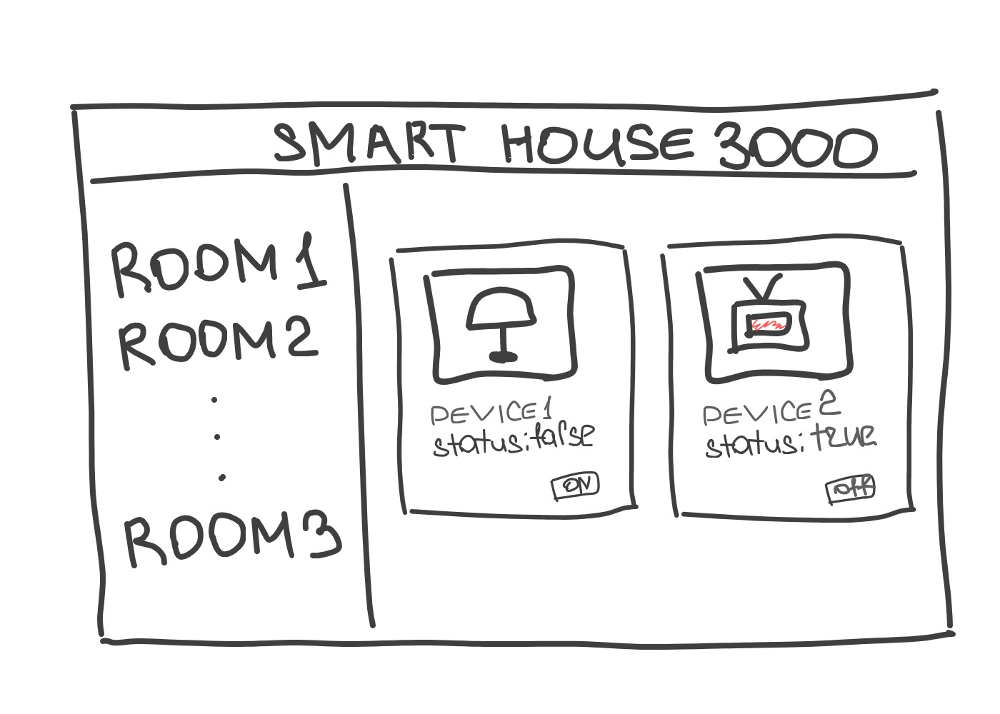

# Smart House 3000

Вау, ты получил своё первое задание на фриланс-бирже Elbrus. Некий umnik3000 создаёт свою систему “ Умный Дом”, и вот что нам известно о проекте:

1. Backend начали писать на `Express` другие разработчики;
2. Необходимо создать Frontend на `React` + `Redux-Thunk` или `Redux-Saga` и связать его с бэком.
3. Оплата проекта - пицца в следующую пятницу

СОВЕТ: Перед тем как начать работу, ознакомься со всеми релизами, чтобы заранее иметь представление о приложении.

## Релиз 0

Внимательно ознакомься с проектом. В папке `backend` написан минимальный функционал умного дома, тебе нужно разобраться, что там происходит.

## Релиз 1

Получи из базы данных список комнат и создай навигационное меню, состоящее из названий комнат. При нажатии на комнату, справа должен отображаться компонент, который должен содержать все элементы (девайсы), которые находятся в этой комнате. Сам компонент девайса должен содержать изображение и статус: включён прибор или нет и кнопку переключения состояния этого прибора (то есть, если у нас в комнате находится чайник в выключенном состоянии, то кнопка должна позволять включить его).

Обрати внимание: карточка девайса должна получать данные о своём состоянии из пропсов.
Важно: Данные о комнатах и приборах в них нужно хранить в `Redux`. В этом и последующих релизах, для работы с редаксом нужно использовать `Redux-Thunk` или `Redux-Saga`.

## Релиз 2

При нажатии на кнопку вкл/выкл, нужно, чтобы поле status у девайса менялось, а также изображение девайса должно меняться на подходящее(если прибор выключен, то ссылка на изображение должна браться из поля `offPicture`, а если включён, то из `onPicture`). Актуальное состояние нужно сохранять в Redux.

## Релиз 3

Наше приложение должно уметь работать с параметризированными запросами. Например, адрес `http//localhost:3001/1` должен отображать компонент с девайсами, находящимися в комнате с `id = 1`.

## Релиз 4

umnik3000 хочет, чтобы его проект шёл в ногу со временем, а это значит, что у нашего приложения должна быть тёмная тема. Реализуй данный функционал с помощью `Context`.

## Релиз 5

О-ооо, наш заказчик узнал, что ты не обычный фронтендщик, а **_fullstack_**! Тебе нужно дописать бэкенд так, чтобы данные на фронте и бэке были синхронизированны, то есть изменение статуса прибора должно сохраняться в импровизированной базе данных на бэкенде (в объекте `db`).
Попробуй поменять статус у какого-то прибора и обновить страницу. Данные сохранились? Отлично, значит, ты всё сделал правильно.

## Релиз 6\*

Если ты сделал все предыдущие релизы, и всё работает отлично, то самое время заняться регистрацией и авторизацией. Сделай отдельную страницу для регистрации и авторизации пользователей, и это приложение станет неотразимо!
